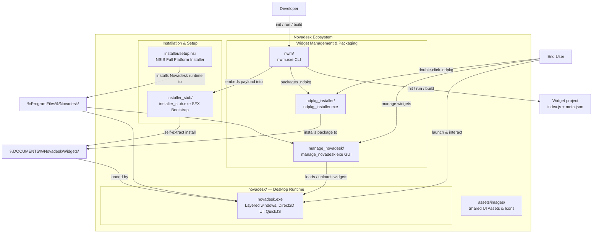
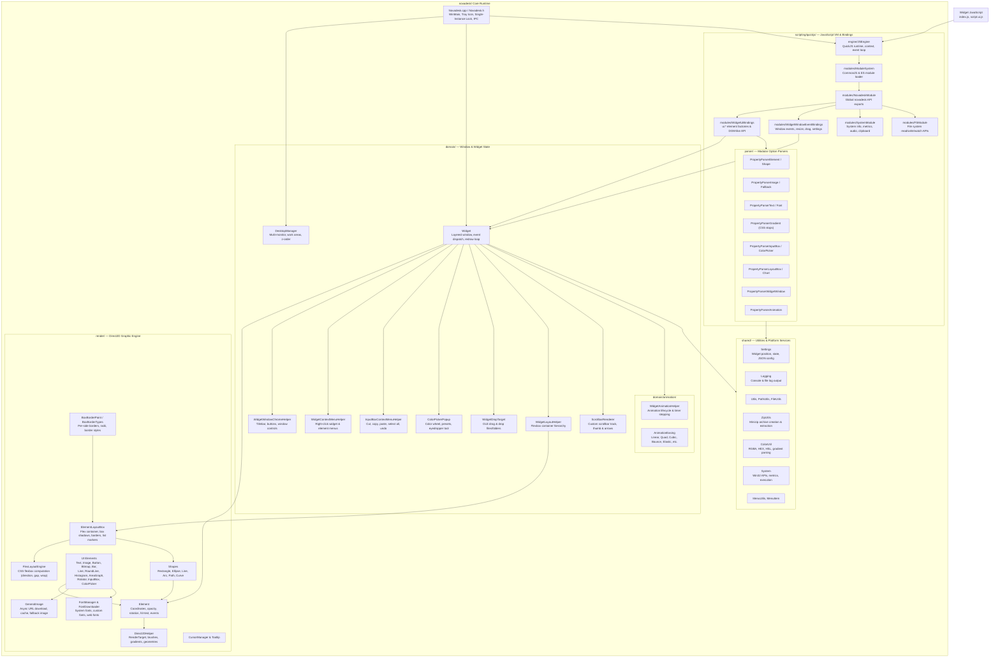
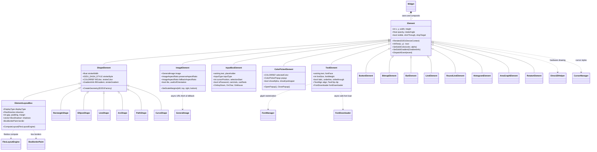
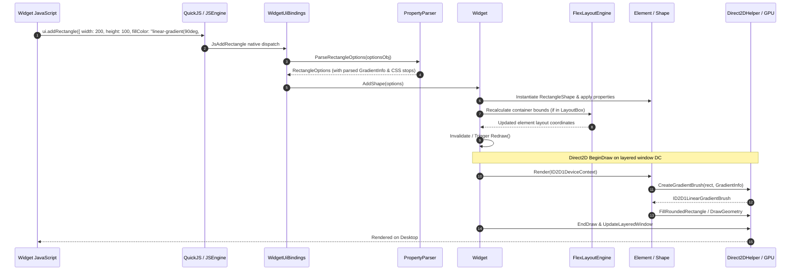
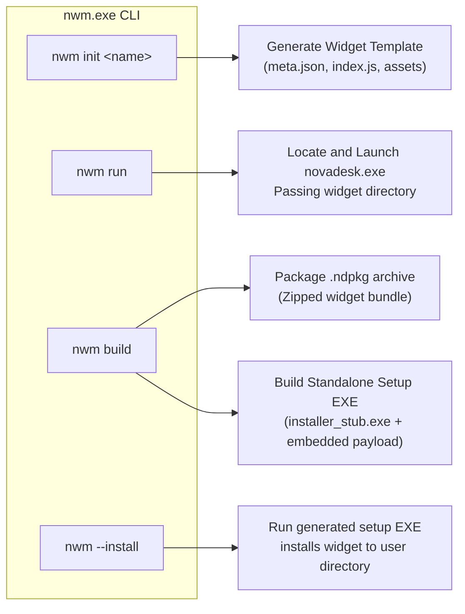

# Novadesk `src/apps` architecture

Mermaid diagrams for everything under [`src/apps`](.) and the application ecosystem. View in GitHub, VS Code (Mermaid preview), or [mermaid.live](https://mermaid.live).

## 1. Applications, Tooling, and Packaging (`src/apps` & `installer/`)

| Path | Role |
|------|------|
| [`novadesk/`](novadesk/) | Core widget runtime: layered windows, Direct2D UI, QuickJS scripting engine |
| [`nwm/`](nwm/) | CLI developer tool: `init`, `run`, `build`, `--install`; builds `.ndpkg` packages and standalone setup EXEs |
| [`manage_novadesk/`](manage_novadesk/) | GUI widget manager: list, load, configure, and monitor active widgets with tray integration |
| [`ndpkg_installer/`](ndpkg_installer/) | Lightweight GUI package installer for `.ndpkg` widget bundles |
| [`installer_stub/`](installer_stub/) | Self-extracting bootstrap EXE stub; payload appended by `nwm build` |
| [`assets/`](assets/) | Shared images, logos, and UI icons for manager and installers |
| [`../../installer/`](../../installer/) | Production NSIS installer (`setup.nsi`) with UAC elevation, per-user docs & AppData setup |

> Build output under `src/apps/x64/` is generated by MSVC projects and is not part of the source layout.

---

## 2. `novadesk/` — Layer Overview

---

## 3. `novadesk/render/` — Element and Shape Tree

---

## 4. Script → Screen Data Flow

---

## 5. `nwm` CLI & Packaging Workflow

---

## Source File Index (by folder)

### `novadesk/domain/`
- **Application & Windows:** `Novadesk.cpp`, `Novadesk.h`, `DesktopManager.cpp`, `DesktopManager.h`, `Widget.cpp`, `Widget.h`
- **Helpers:** `WidgetWindowChromeHelper.cpp`, `WidgetContextMenuHelper.cpp`, `InputBoxContextMenuHelper.cpp`, `WidgetDropTarget.cpp`, `WidgetLayoutHelper.cpp`, `ScrollbarRenderer.cpp`, `ColorPickerPopup.cpp`
- **Animation (`domain/animation/`):** `WidgetAnimationHelper.cpp`, `AnimationEasing.cpp`

### `novadesk/scripting/quickjs/`
- **Engine:** `engine/JSEngine.cpp`, `engine/JSEngine.h`
- **Module System:** `modules/ModuleSystem.cpp`, `modules/NovadeskModule.cpp`, `modules/WidgetUiBindings.cpp`, `modules/WidgetWindowEventBindings.cpp`, `modules/SystemModule.cpp`, `modules/FSModule.cpp`
- **Parsers (`parser/`):** `PropertyParserElement.cpp`, `PropertyParserShape.cpp`, `PropertyParserImage.cpp`, `PropertyParserText.cpp`, `PropertyParserGradient.cpp`, `PropertyParserLayoutBox.cpp`, `PropertyParserChart.cpp`, `PropertyParserAnimation.cpp`, `PropertyParserInputBox.cpp`, `PropertyParserColorPicker.cpp`, `PropertyParserWidgetWindow.cpp`, `PropertyParserJs.cpp`, `PropertyParserTypes.h`

### `novadesk/render/`
- **Base & Hardware:** `Element.cpp`, `ShapeElement.cpp`, `Direct2DHelper.cpp`, `CursorManager.cpp`, `Tooltip.cpp`, `GeneralImage.cpp`
- **Layout & Box Model:** `ElementLayoutBox.cpp`, `FlexLayoutEngine.cpp`, `BoxBorderPaint.cpp`, `BoxBorderTypes.h`
- **Text & Typography:** `TextElement.cpp`, `FontManager.cpp`, `FontDownloader.cpp`
- **Input & Controls:** `InputBoxElement.cpp`, `ColorPickerElement.cpp`, `ButtonElement.cpp`
- **Shapes:** `RectangleShape.cpp`, `EllipseShape.cpp`, `LineShape.cpp`, `ArcShape.cpp`, `PathShape.cpp`, `CurveShape.cpp`
- **Meters & Visualizations:** `BitmapElement.cpp`, `BarElement.cpp`, `LineElement.cpp`, `RoundLineElement.cpp`, `HistogramElement.cpp`, `AreaGraphElement.cpp`, `RotatorElement.cpp`

### `novadesk/shared/`
`Settings.cpp`, `Logging.cpp`, `Utils.cpp`, `PathUtils.cpp`, `FileUtils.cpp`, `ZipUtils.cpp`, `MenuUtils.cpp`, `MenuItem.h`, `ColorUtil.h`, `System.cpp`

### Tooling & Installers
- **`nwm` (CLI):** `src/main.cpp`, `src/rescle.cc`
- **`manage_novadesk` (GUI Manager):** `main.cpp`
- **`ndpkg_installer` (Package Installer):** `main.cpp`
- **`installer_stub` (SFX Stub):** `src/installer_stub.cpp`
- **`installer` (NSIS Installer):** `setup.nsi`
